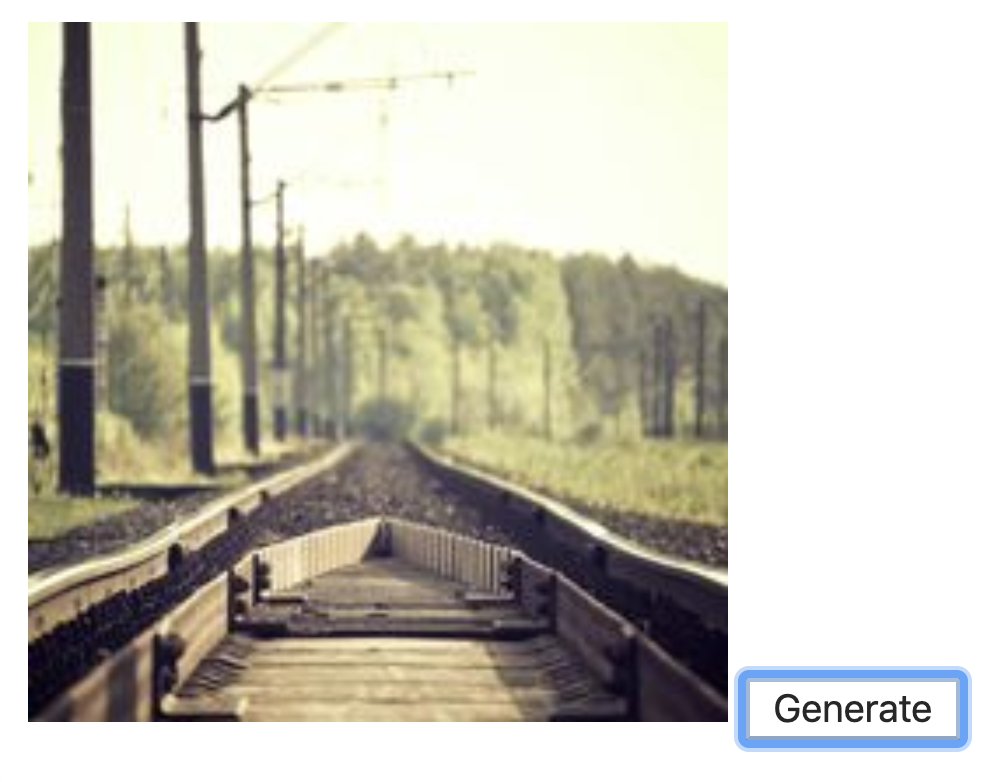
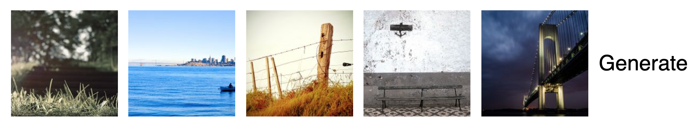
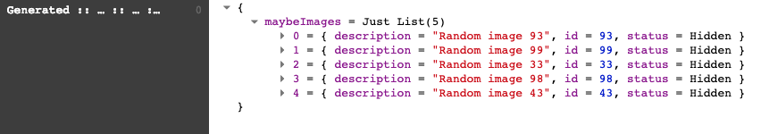
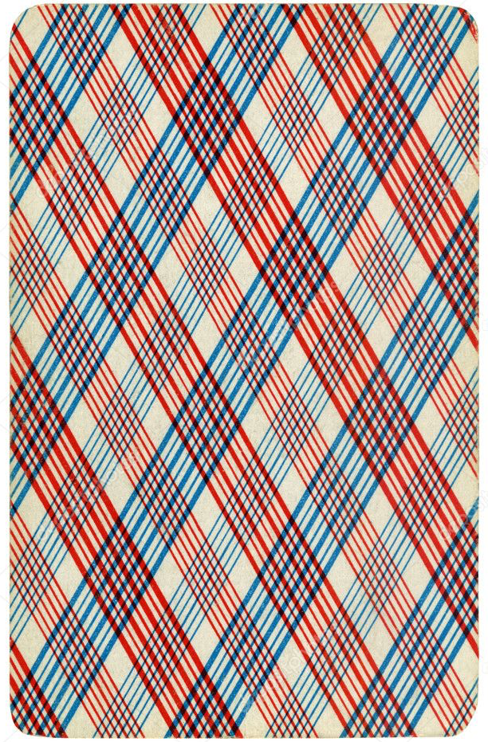
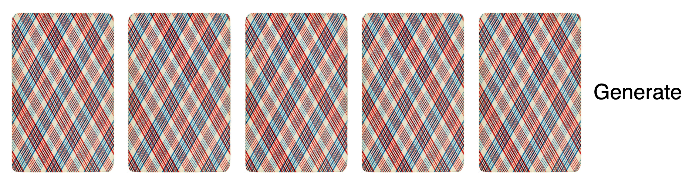
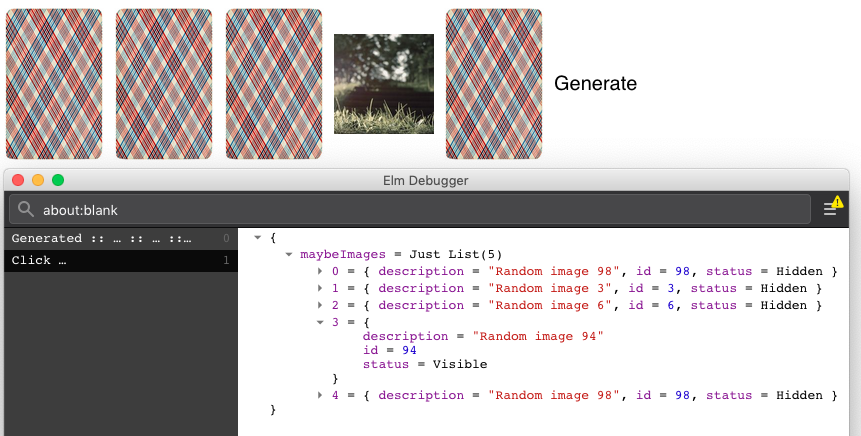
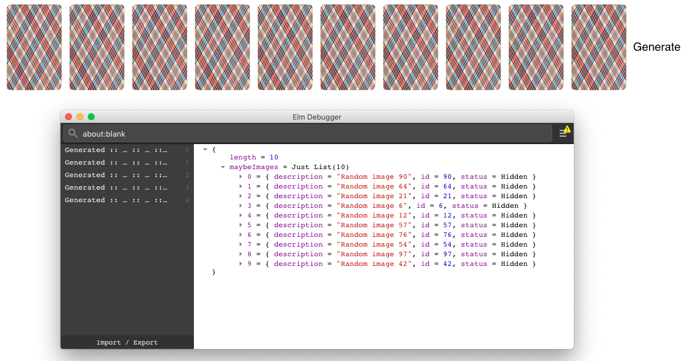
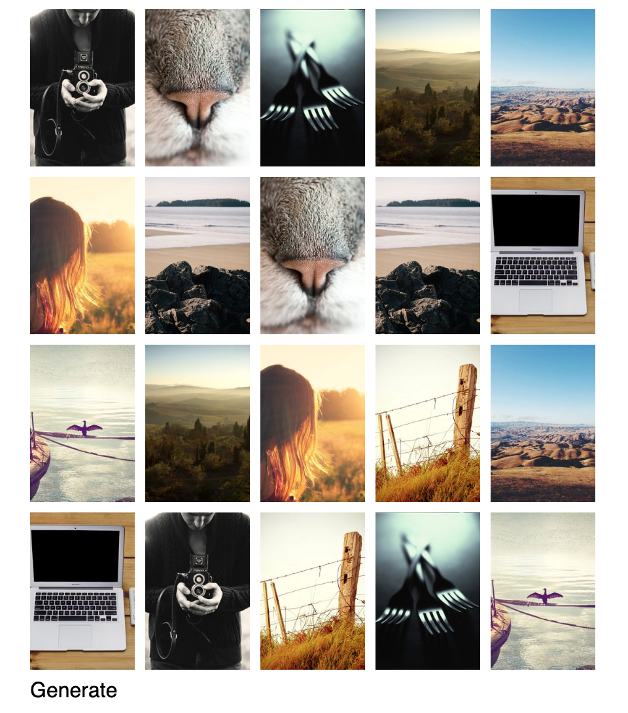
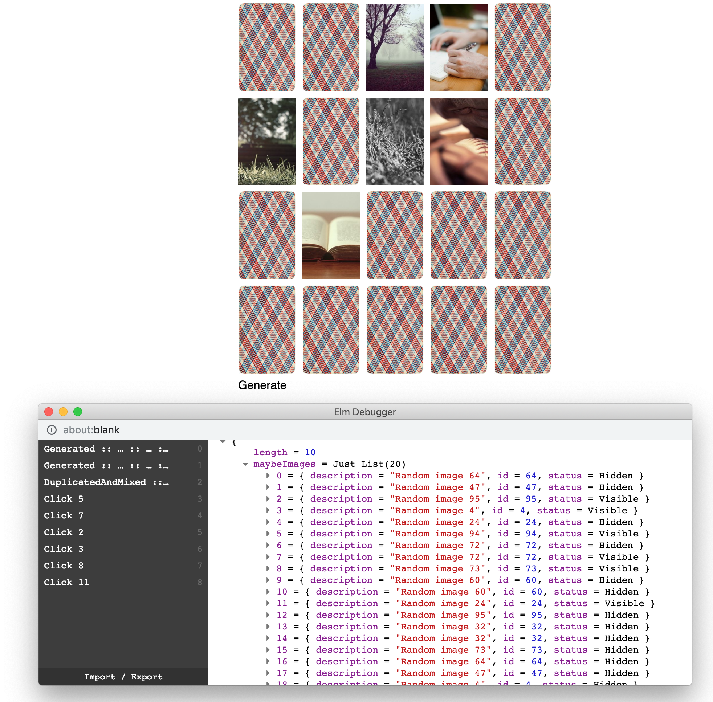
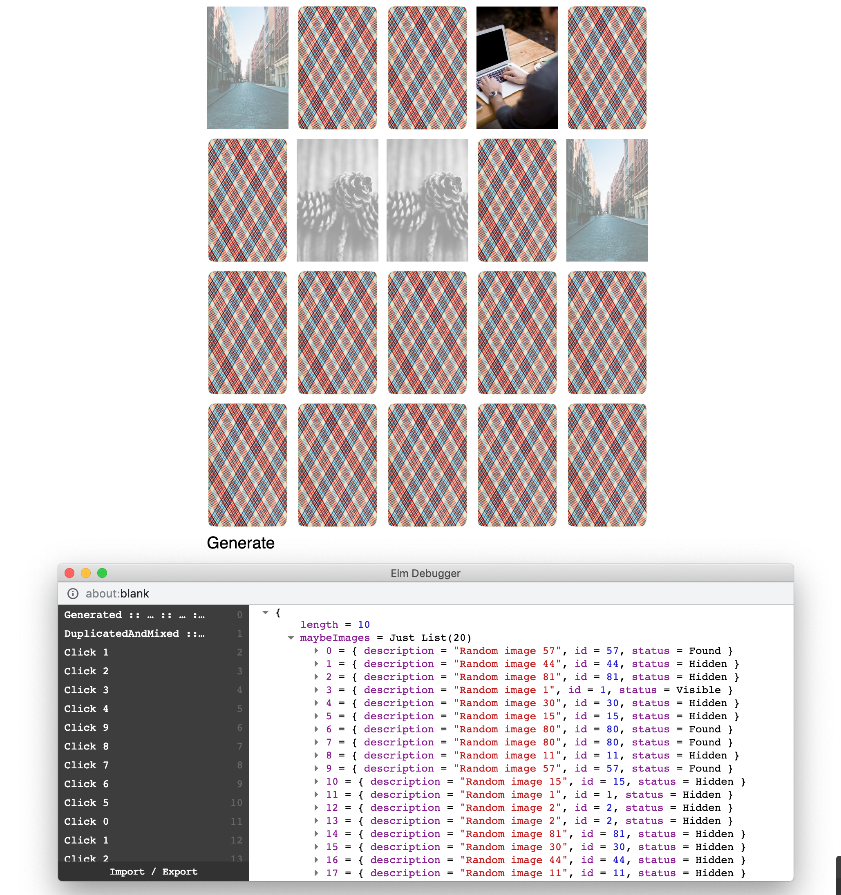

# elm-memory-game
Basic Memory game built with Elm 0.19

[Play now](http://rdelgatte.github.io/elm-memory-game)

THE RULES FOR PLAYING "MEMORY"
- Mix up the cards.
- Lay them in rows, face down.
- Turn over any two cards.
- If the two cards match, keep them.
- If they don't match, turn them back over.
- Remember what was on each card and where it was.
- The game is over when all the cards have been matched.

## Step-by-step build

### Step-0: Start the application

Checkout branch `step-0` and run `elm-live src/Main.elm --port=1234 --open  -- --output=main.js --debug`

In this branch, you will find a single button and a value which is randomly generated (from 1 to 100).


Once it is done, you can go to the next step: `git checkout -f step-1`

### Step-1: Render image

Instead of displaying the random value, we will now use [Picsum photo](https://picsum.photos/) to render a picture by its id.

For example: when 13 is rendered, we should render picture whose url is `https://picsum.photos/200/300?image=13`.



Once it is done, you can go to the next step: `git checkout -f step-2`

### Step-2: Use `elm-ui`

- Install [elm-ui](https://package.elm-lang.org/packages/mdgriffith/elm-ui/latest/) so our layout and style are explicit and easy to modify.
You can see it as a layer over `elm/html`. 

- Transform your code to use only `elm-ui` elements

```elm
img => Element.image 
```
```elm
div => Element.row | Element.column | Element.el
```

```elm
button : Element Msg
button =
    { onPress = Just Generate
    , label = text "Generate"
    }
        |> Input.button []
```

- Use `Element.layout` to transform `Element` to `Html Msg`

You can now arrange your elements easily (without a single line of CSS).

- Bonus: Create a function which takes an Int (image id) and returns the image:

```elm
renderImage : Int -> Element Msg
renderImage imageId = ...
```

Once it is done, you can go to the next step: `git checkout -f step-3`

### Step-3: Generate multiple images 

In this step, we need to change the `Model` so we can have a list of multiple values and then render the images as expected

- Change `Model` to get `values: List Int`
- Check your compiler for the next steps :-) 

You can generate 5 random images for this example



--- 
**Few tips** 
- We need to change the function to generate a `List` of `Int`. You can use: 
```elm
generate : Int -> Int -> Cmd Msg
generate min max =
    max
        |> Random.int min
        |> Random.list 5
        |> Random.generate Generated
```
- The result of `Generated` should change accordingly
- You can transform the list of generated image ids to images using:
```elm
images : List (Element Msg)
images =
    values
        |> List.map (\imageId -> imageId |> renderImage)
```

Once it is done, you can go to the next step: `git checkout -f step-4`

### Step-4: Image model

Images can have multiple states in a memory game: 
- *Hidden* = reverse side of the card (initial state) 
- *Visible* = when user click on it to discover the image
- *Found* = when user found associated images

We need to explicitly define a `Image` type to handle images in the application.

- Create a new Elm file `Image.elm` which defines a new `type alias` for `Image` with following attributes:
    - `id`: `Int`
    - `description`: `String`
    - `status`: `Status`

You also need to create a `Status` type to highlight the three status we highlighted before.

- Instead of generating an `Element.image` from the generated Id, we will now build an `Image` from a provided id using a build function like:
```elm
buildImage: Int -> Image
buildImage id = ...
```
You can set the default status of the Image to `Hidden` for now.

- Transform function `renderImage` to get an `Image` and return a `Element Msg` as before

Once it is done, you can go to the next step: `git checkout -f step-5`

### Step-5: Images in the Model

You could notice that values in the Model are just a `List` of `Int` but it'd rather be better to get the list of `Image` instead.

- Change `Model` to:
```elm
type alias Model =
    { images : Maybe (List Image) }
```
- Refactor your code to get your compiler happy :-)
- Following your best friend (= elm compiler) and documentation, you should be able to get your application up and running as before.

As a result, when opening your elm debugger, you should now see:



- Bonus: you can change the initial state of the application by not calling `generate` on load: 
```elm
initialModel : () -> ( Model, Cmd Msg )
initialModel _ =
    ( { maybeImages = Nothing }, Cmd.none )
```
This way, you should see the message when no images are loaded.

--- 
**Few tips** 
- `Maybe` should be used so the initial state of our application has `Nothing` as `images` and will be updated with data when getting ramdom id.
- `view` also needs to handle the case where `values = Nothing` to show something like `Loading...`

Once it is done, you can go to the next step: `git checkout -f step-6`

### Step-6: Handling images status

As described in [step-4](#step-4-image-model) we defined three `Status` for our images but we now need to use them so the image rendering depend on them.

When image status is `Hidden`, we should render `card.png` which is:


Otherwise, we should render the image as it is

- Rework function `renderImage` so you return the right image according to image state 
```elm
renderImage : Image -> Element Msg
```
You should see all images as `card.png` because the default `status` is set to `Hidden`:



- Change default status of Image (in `buildImage`) to `Visible` and validate you get the former behaviour.

--- 
**Tip** 

You need to expose `Image.Status` in `Image.elm` file so you can use it in `Main.elm`

Once it is done, you can go to the next step: `git checkout -f step-7`

### Step-7: OnClick to change the image status

Now we get our cards reversed, we would like to show them when clicking on it.

To do so, the only thing to do is to switch the status of the image we've just clicked to `Visible`.

- Create a new `Msg` which is `Click` and takes an `Image` as a parameter
- Inline your `Element.Image` within an `Input.button` (use `Element.Input`) and call the previously created `Msg`
- Implement the `Click` Msg to update the image status from the list of `Image` in the `Model`

You should get something like this in the end: 



- Bonus: When the image is already rendered, it should not be clickable anymore.

--- 
**Few tips** 
- Here is the `Input.button` signature (from elm-ui):
```elm
button :
    List (Attribute msg)
    ->
        { onPress : Maybe msg
        , label : Element msg
        }
    -> Element msg
```
So our `label` here can be the `Element.Image` we dealt with before.
- Updating the list of images can be done using `List.map` filtering on the one you clicked to update its status  
```elm
images
    |> List.map
        (\image ->
            case image.id == id of
                False ->
                    image
  
                True ->
                    { image | status = Visible }
        )
```

Once it is done, you can go to the next step: `git checkout -f step-8`

### Step-8: Generate a first batch of unique cards

In the previous steps, we generated random images without regarding whether there were duplicated image id for example.

In this step, we will focus on generating 10 unique images. We don't know yet what numbers will be produced by the `generate` function (= random) so we may generate 10 numbers but with some duplicates.

So here, we will:
- Generate 10 numbers: update the `generate` function to return a list of 10 numbers
- Filter these 10 numbers to make sure there is no duplicates
    - If none are duplicated, we generate the images as before
    - Else, we re-roll until we get a list of unique numbers
- Bonus: Set the `length` of images we want to generate in the `Model` so we can quickly change the number of cards we want.

In the end, you should see:


In the above picture, you can notice we needed 5 rolls before having 10 unique numbers (it's not really nice, but it's just for the exercise).

--- 
**Few tips** 
- To get a simple way to do a distinct of a list, as they are only `Int` values, you can transform the `List` to a `Set` and evaluates whether their length match:
```elm
distinctListSize: Int
distinctListSize = randomValues |> Set.fromList |> Set.size
```
- When there are duplicated data, `Generated` returns `( model, generateValues model )` so it does not change the model but replay the `generate` function.

Once it is done, you can go to the next step: `git checkout -f step-9`

### Step-9: Duplicate and mix images 

So now, we have 10 unique images, we need to duplicate and mix them so we place them in a random order. 

- Duplicate all images when building the list of `Image` in the `Model`
- Mix all images 

In the end, you should see:


What happens when you click over one image? Why?

--- 
**Few tips**
- Duplicating a list is the same as appending the same values twice.
- To mix the codes, we can use `Random.List.shuffle` which returns a `Random.Generator` so a side effect to handle.

Once it is done, you can go to the next step: `git checkout -f step-10`

### Step-10: Use images list index 

You could notice after previous step, when clicking over an image, both images (with the same id) were discovered.

In this step, we are going to fix this by using the `List` index instead of the image id.

- Change the `Msg` `Click Image` to `Click Int` so we get the index of the item being clicked
- Refactor function `updateImagesOnClick` to get the index being clicked as a parameter so you update the image status for the item of the list with the provided index
```elm
updateImagesOnClick : Maybe (List Image) -> Int -> Maybe (List Image)
``` 

After doing this, you should be able to see: 


--- 
**Few tips**
- To get the index of the item from the list, you can use `List.indexedMap`
- To update the status of the right image (with provided index), you can do as following:
```elm
images
    |> List.indexedMap
        (\index image ->
            case index == clickedIndex of
                False ->
                    image

                True ->
                    visible image
        )
```

Once it is done, you can go to the next step: `git checkout -f step-11`

### Step-11: Tag images as found when duplicates are visible

In this step, we will have to flag our images as `Found` whenever we discover a card which has is associated image visible as well.

- Create a function which takes the `Maybe (List Image)` and returns an up-to-date `Maybe (List Image)`:
The signature could be something like:
```elm
refreshImagesStatus : Maybe (List Image) -> Maybe (List Image)
```
This function will go through images and will determine whether the image should be flagged as `Found` meaning there is already another `Visible` image with the same `Image.id` in the list of not.

To help you, I wrote some unit tests so you can run them while coding the function. If the tests pass, you can go through the next step. 

- Call the function at the right place (right after the clicked image status passed to `Visible`)

- Check your debugger to validate the status of the images being changed to `Found` when expected

I moved some helpful functions to build the `Element.image` passing an `Image` inside file `Image.elm`: 
```elm
imageUrl : Image -> String
imageUrl { id, status } =
    case status of
        Hidden ->
            "doc/card.png"

        _ ->
            (id |> fromInt)
                |> String.append "https://picsum.photos/200/300?image="

renderImage : Image -> Element msg
renderImage image =
    { src = image |> imageUrl
    , description = image.description
    }
        |> Element.image [ width (px 100) ]

```

- Create a new function which will return the `Element.image` attributes so we can style differently whenever the image is `Found`:
```elm
imageStyle : Image -> List (Attribute msg)
```

Once it is done, you can go to the next step: `git checkout -f step-12`

## Final step

Now we can identify whether the images are found which is nice but we also need to reverse the cards when two were played but were not the same. 

To do so, we can do as before using function `refreshImageStatus` but we have to update it so:
- Whenever I click a new `Image` and I already have two images as `Visible`, I should force these two images to be `Hidden`. 

I can identify which image has been clicked passing the index so we need to change the signature of the function as below:
```elm
refreshImagesStatus : Int -> Maybe (List Image) -> Maybe (List Image)
```

From the list of provided images, I can:
    - Count all `Visible` images 
    - If I have more than 2 `Visible` images, I should iterate over images and set `Visible`them to `Hidden` except for the provided index
    - Else, we return images as they are
We can do that in a separate function whose signature could be:
```elm
hideImages : Int -> List Image -> List Image
hideImages index images = ...
```
This function would return the list of `Image` after updating their status to `Hidden` when necessary.

- Once developing this function, we need to call it before updating images status to `Found` when necessary

You should get the expected behaviour once doing that:



--- 
**Few tips**
- I updated some unit tests in `ImageTest.elm` so you can run them to help you building this step
- Here are some use cases:

When clicking an image which its duplicate is already `Visible`:

```elm
original : List Image
original =
    [ Image 1 "1" Visible
    , Image 3 "3" Hidden
    , Image 2 "2" Hidden
    , Image 2 "2" Hidden
    , Image 1 "1" Visible
    , Image 3 "3" Hidden
    ]
expected : List Image
expected =
    [ Image 1 "1" Found
    , Image 3 "3" Hidden
    , Image 2 "2" Hidden
    , Image 2 "2" Hidden
    , Image 1 "1" Found
    , Image 3 "3" Hidden
    ]
```

When clicking an image and none other image is `Visible`:

```elm
original : List Image
original =
    [ Image 1 "1" Hidden
    , Image 3 "3" Hidden
    , Image 2 "2" Found
    , Image 2 "2" Found
    , Image 1 "1" Visible
    , Image 3 "3" Hidden
    ]
expected : List Image
expected = original
```

When clicking an image and another image is `Visible` but without the same id:
    
```elm
original : List Image
original =
    [ Image 1 "1" Hidden
    , Image 3 "3" Hidden
    , Image 2 "2" Found
    , Image 2 "2" Found
    , Image 1 "1" Visible
    , Image 3 "3" Visible
    ]
expected : List Image
expected = original
```

When clicking over image 2 (index = 2) and two other images are already `Visible` but none of them share the same id as the one being clicked:

```elm
original : List Image
original =
    [ Image 1 "1" Hidden
    , Image 3 "3" Hidden
    , Image 2 "2" Visible
    , Image 2 "2" Hidden
    , Image 1 "1" Visible
    , Image 3 "3" Visible
    ]
expected : List Image
expected = 
    [ Image 1 "1" Hidden
    , Image 3 "3" Hidden
    , Image 2 "2" Visible
    , Image 2 "2" Hidden
    , Image 1 "1" Hidden
    , Image 3 "3" Hidden
    ]
```
