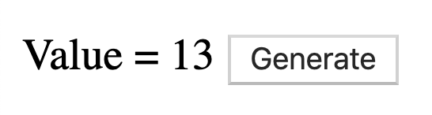

# elm-memory-game
Basic Memory game built with Elm 0.19

[Play now](http://rdelgatte.github.io/elm-memory-game)

THE RULES FOR PLAYING "MEMORY"
- Mix up the cards.
- Lay them in rows, face down.
- Turn over any two cards.
- If the two cards match, keep them.
- If they don't match, turn them back over.
- Remember what was on each card and where it was.
- The game is over when all the cards have been matched.

## Step-by-step build

### Step-0: Start the application

Checkout branch `step-0` and run `elm-live src/Main.elm --port=1234 --open  -- --output=main.js --debug`

In this branch, you will find a single button and a value which is randomly generated (from 1 to 100).

Once it is done, you can go to the next step: `git checkout -f step-1`